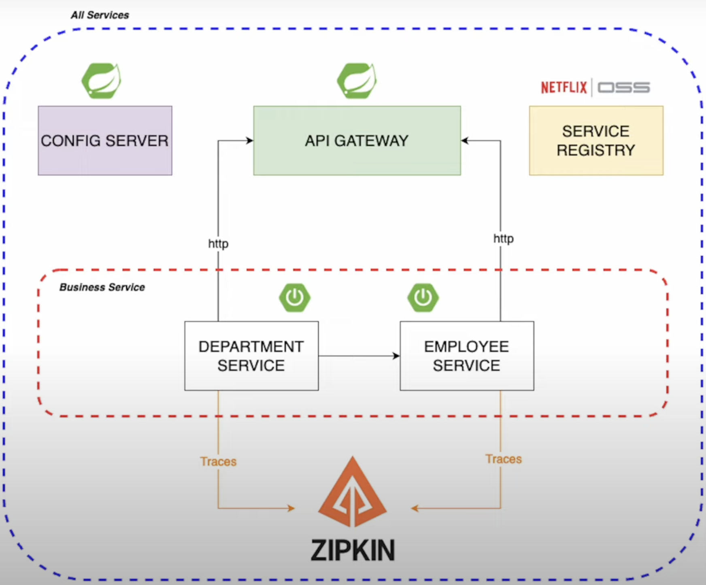

# Spring Boot Microservices (v3)

> ✅ **Part of the [Spring Boot Roadmap](https://github.com/arsy786/spring-boot-roadmap)** — a curated masterclass covering everything from Java basics to advanced Spring Boot practices and projects.

It is one of several interconnected repositories making up the broader [Spring Boot Roadmap](https://github.com/arsy786/spring-boot-roadmap), which provides a complete learning journey.

---

This is a Java Spring Boot project that demonstrates the implementation of microservices architecture using Spring Boot 3.

This project was created by following the tutorial: [Microservices using SpringBoot 3.0 (YouTube/DailyCodeBuffer)](https://www.youtube.com/watch?v=HFl2dzhVuUo&ab_channel=DailyCodeBuffer)

## Table of Contents

- [Microservices Spring Boot Project](#microservices-spring-boot-project)
  - [Table of Contents](#table-of-contents)
  - [Overview](#overview)
  - [Features](#features)
  - [Getting Started](#getting-started)
    - [Prerequisites](#prerequisites)
    - [Cloning the Repository](#cloning-the-repository)
    - [Running Services](#running-services)
    - [Running Zipkin for Distributed Tracing](#running-zipkin-for-distributed-tracing)
    - [Note](#note)
    - [Using the API](#using-the-api)

## Overview

This project provides a sample implementation of microservices using Spring Boot and Spring Cloud. It showcases the usage of various Spring Cloud components to build a distributed system. The project includes multiple microservices that communicate with each other through RESTful APIs. Below is the microservices architecture diagram.



- **Discovery Service (Eureka Server)**: Manages service discovery and registration. It uses Netflix Eureka Server to register microservices and facilitate inter-service communication.
- **Config Service**: Provides centralized configuration management for microservices. It uses Spring Cloud Config Server to serve configuration properties stored in a Git repository.
- **API Gateway (Zuul Gateway)**: Acts as the entry point for client requests, offering routing, filtering, and load balancing. It uses Netflix Zuul Gateway for request routing and filtering.
- **Employee & Deportment Microservices**: Microservices that provide specific functionalities and communicate through the API Gateway.
- **Distributed Tracing (Zipkin)**: Visualizes trace data between and within services. Allows us to correlate activity between servers and get a much clearer picture of exactly what is happening in our services.

## Features

- Demonstrates the usage of Spring Boot and Spring Cloud for building microservices.
- Implements service discovery and client-side load balancing using Eureka.
- Uses Spring Cloud Config for externalized configuration management.
- (!)Illustrates circuit breaker pattern and fault tolerance with Hystrix.
- Includes distributed tracing and monitoring using Spring Cloud Sleuth and Zipkin.
- Implements API gateway pattern with Zuul to provide a unified entry point for the microservices.
- Utilizes Spring Cloud Stream for event-driven communication between microservices.

## Getting Started

### Prerequisites

To run this project locally, you need to have the following prerequisites installed:

- Git
- Java 17
- Maven
- Docker (optional, for running with containers)

### Cloning the Repository

1. Open your terminal or command prompt.

2. Clone the repository using Git:

   ```bash
   git clone https://github.com/arsy786/spring-boot-microservices-3.git
   ```

3. Navigate to the cloned repository's root directory:

   ```bash
   cd spring-boot-microservices-3
   ```

### Running Services

To run each service, follow these steps:

1. Navigate to the respective service directory:

   ```bash
   cd <service-directory>
   ```

2. Run the following Maven command to build and start the service:

   ```bash
   # For Maven
   mvn spring-boot:run

   # For Maven Wrapper
   ./mvnw spring-boot:run
   ```

### Running Zipkin for Distributed Tracing

To enable distributed tracing in your microservices architecture, you can use Zipkin. Follow these steps to set up Zipkin using Docker:

1. Run the following Docker command to pull and start the Zipkin container:

   ```bash
   docker run -d -p 9411:9411 openzipkin/zipkin
   ```

2. Once the Zipkin container is up and running, you can access the Zipkin web interface by navigating to:

   ```bash
   http://localhost:9411
   ```

### Note

Ensure that the Discovery Service (Eureka Server), Config Service, API Gateway, and Zipkin are running before starting individual microservices to ensure proper service registration, configuration, routing, and tracing, respectively.

### Using the API

Once all microservices are up and running, you can interact with them through the API Gateway. The API documentation and endpoints can be accessed via the API Gateway URL.

```bash
# api-gateway
http://localhost:8060/employee
http://localhost:8060/department
```

The REST API is documented with Swagger. After starting the application, access the Swagger UI to interact with the API at:

```bash
# department-service
http://localhost:8081/swagger-ui/index.html

# employee-service
http://localhost:8082/swagger-ui/index.html
```
